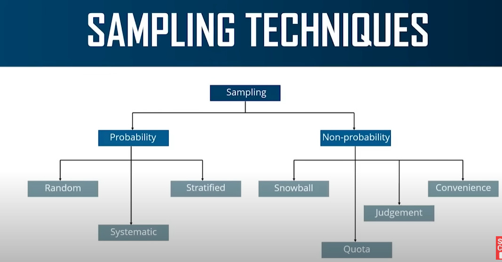

# Hướng dẫn học máy
- Trong cuộc sống có rất nhiều thứ ta có thể dàng làm bằng việc sử dụng machine learning, như: kiểm tra giới tính, kiểm tra email là spam hay không, kiểm tra giao dịch có gian lận không,...
- Có rất nhiều thứ có thể hỏi machine, nhưng để thu được câu trả lời ta cần có thuật toán. Machine sẽ được huấn luyện dựa trên thuật toán đó. Tiếp theo, ta sẽ tìm hiểu về từng loại thuật toán.

# Classification Algorithm
Classification là quá trình xây dựng một mô hình từ dữ liệu huấn luyện được gán nhãn để phân loại các mẫu chưa được gán nhãn. Nó được sử dụng rộng rãi trong nhiều ứng dụng như phát hiện thư rác, nhận diện giọng nói, phân loại hình ảnh,...

# Anomaly detection Algorithm
Anomaly detection là quá trình phát hiện, nhận dạng và đưa ra cảnh báo về các điểm dữ liệu không bình thường hoặc không đúng với mô hình thông thường. Nó được sử dụng trong nhiều lĩnh vực khác nhau như giám sát hệ thống, phát hiện gian lận, phát hiện tế bào ung thư,...

# Clustering Algorithm
Clustering dùng để phân loại các nhóm data dựa trên những tính chất giống nhau. Nó được ứng dụng để phân tích hành vi khách hàng, phân loại văn bản, phân tích ảnh và thị giác máy tính,...

# Regression Algorithm
Regression sử dụng mô hình hồi quy để dự đoán giá trị của biến phụ thuộc từ các giá trị của các biến độc lập. Nó thường sử dụng trong dự báo thời tiết, dự đoán doanh số bán hàng,...

# Chương trình đầu tiên

# Thống kê và xác suất trong machine learning
## What is the data?
Trong Machine Learning, data (dữ liệu) là tập hợp các thông tin và giá trị được thu thập hoặc tạo ra để sử dụng trong việc huấn luyện các mô hình Machine Learning. Dữ liệu có thể được thu thập từ nhiều nguồn khác nhau, bao gồm các bộ dữ liệu công khai, các hệ thống cơ sở dữ liệu và các ứng dụng web.
## Categories of data
Data được chia làm hai loại là dữ liệu định tính (qualitative data) và dữ liệu định lượng (quantitative data).
- **Qualitative data**: gồm 2 loại
  - **Nominal data (dữ liệu định danh)** mô tả các thuộc tính hay biến số không có thứ tự hay tầng lớp nhất định. Ví dụ, giới tính, màu sắc, loài động vật, và tình trạng hôn nhân,...
  - **Ordinal data (dữ liệu thứ tự)** là một loại dữ liệu định tính mà các giá trị có thứ tự nhất định. Ví dụ, trình độ học vấn, trạng thái việc làm, mức độ hài lòng của khách hàng,...
- **Quantitative data**: gồm 2 loại
  - **Discrete data (dữ liệu rời rạc)**: là một loại dữ liệu số học mà các giá trị chỉ nhận được các giá trị rời rạc hoặc giới hạn trong một tập hợp cố định, ví dụ như số lượng người trong một phòng, số lượng sản phẩm được bán trong một ngày,...
  - **Continuous data (dữ liệu liên tục)**: là một loại dữ liệu số học mà các giá trị có thể nhận bất kỳ giá trị nào trong một khoảng liên tục, ví dụ như thời gian, trọng lượng, chiều cao và nhiệt độ,...

## What is statistics?
**Thống kê** là một lĩnh vực toán học ứng dụng liên quan đến việc thu thập, phân tích, giải thích và trình bày dữ liệu.
**Ví dụ:** Thống kê hiệu quả của thuốc chữa bệnh ung thư mới sản xuất, thống kê sỉ số của một trấn đấu bóng chày,...

## Basic terminologies in statistics
Bỏ qua nha (\^_^)

## Sampling techniques
Giả sử ta cần thống kê thói quen ăn uống của tất cả các người vị thành niên ở nước Mĩ gồm 42 triệu người. Nếu khảo sát từng người thì điều đó là bất khả thi. Vì vậy ta cần phải có kĩ thuật lấy mẫu trước khi phân tích thống kê.

Trong bài này ta sẽ tập trung vào **probability sampling**. Phương pháp này gồm 3 loại
- **Random sampling** là phương pháp chọn mẫu ngẫu nhiên từ toàn bộ population. Khi sử dụng phương pháp này, mỗi đối tượng trong population có cơ hội bị chọn làm mẫu như nhau.
- **Systematic sampling** là phương pháp chọn mẫu bằng cách chọn mỗi đối tượng kế tiếp trong danh sách theo một bước nhảy xác định. Ví dụ, nếu chọn mỗi đối tượng thứ 5 từ population, đối tượng thứ 5, 10, 15, 20, v.v. sẽ được chọn.
- **Stratified sampling** là phương pháp chọn mẫu bằng việc phân chia population thành các nhóm nhỏ dựa trên một số đặc điểm nhất định (ví dụ: giới tính, độ tuổi, thu nhập, trình độ học vấn, v.v.). Sau đó, một mẫu ngẫu nhiên được chọn từ mỗi nhóm nhỏ để tạo thành mẫu tổng thể.

## Types of statistics
Gồm 2 loại chính:
- **Thống kê mô tả (Descriptive statistics)** là phương pháp sử dụng các số liệu và biểu đồ để mô tả, tổng hợp và diễn giải thông tin trong một tập dữ liệu. Thống kê mô tả giúp ta hiểu và trình bày các đặc tính cơ bản của dữ liệu, bao gồm trung bình, phương sai, độ lệch chuẩn, phân vị, tần số và tỉ lệ của các giá trị.
- **Thống kê suy luận (Inferential statistics)** đưa ra các suy luận và dự đoán về đặc tính của toàn bộ không gian mẫu (population) dựa trên dữ liệu thu thập được trên mẫu.

## Descriptive statistics
Được chia làm 2 loại:
- **Measureof central tendency** là một đại lượng thống kê mô tả mức độ tập trung của một tập dữ liệu, thường bao gồm: Trung bình (Mean), trung vị (Median), Mode.
- **Measures of variability(spread)** là một đại lượng thống kê mô tả mức độ phân tán của một tập dữ liệu, thường bao gồm: Phương sai (Variance), độ lệch chuẩn (Standard deviation), phạm vi (Range), tứ phân vị (Inter Quartile Range).

## Information gain and entropy
- **Entropy** là một đại lượng thể hiện mức độ không chắc chắn của một tập dữ liệu hoặc một biến ngẫu nhiên. Giá trị entropy càng cao thì tập dữ liệu càng không chắc chắn. Công thức tính entropy:
    
- **Information gain** đo lượng thông tin được giữ lại sau khi sử dụng một thuộc tính để phân chia dữ liệu. Công thức tính information gain:
    

## Use case
Tính toán entropy và information gain của từng thuộc tính. Chọn thuộc tính có information gain cao nhất làm gốc của cây quyết định (Decision Tree).
[Link tham khảo](https://trituenhantao.io/kien-thuc/decision-tree/)
