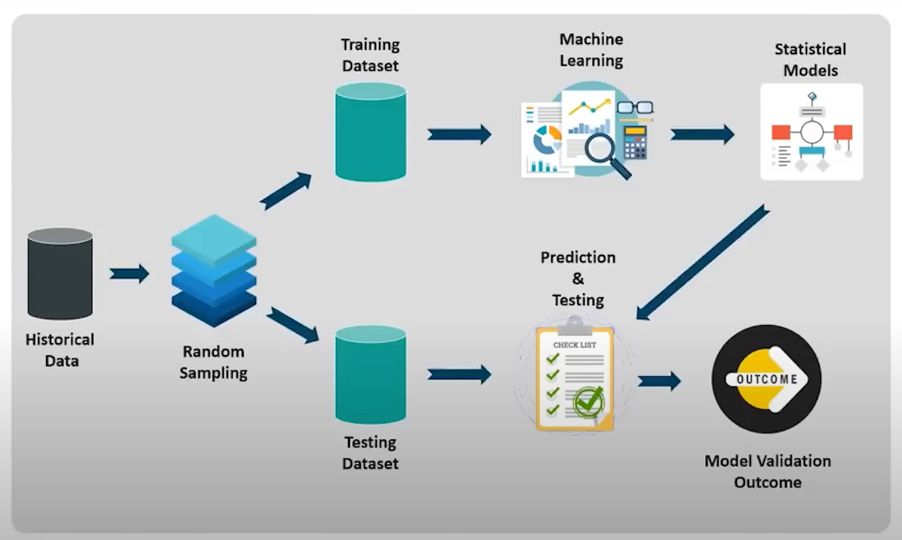
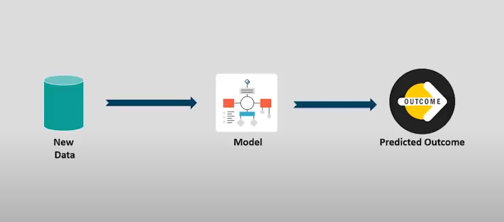
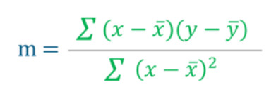
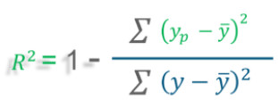

## Confusion matrix
- Là một ma trận dùng để đánh giá hiệu suất của một mô hình phân loại.
- Confusion matrix thường có dạng bảng hai chiều, trong đó các hàng đại diện cho các nhãn thực tế của mẫu, các cột đại diện cho các nhãn được dự đoán bởi mô hình. Bảng này bao gồm các giá trị True Positive (TP), False Positive (FP), False Negative (FN) và True Negative (TN), được tính bằng số lượng mẫu được phân loại đúng và sai.

## Probability
Học rồi nên bỏ qua

## Supervised Learning (học giám sát)
- Supervised Learning là khi có các biến đầu vào x và các biến đầu ra y, ta sử dụng thuật toán để tìm hàm ánh xạ từ đầu vào đến đầu ra.
- Supervised learning được chia ra làm 2 quá trình:
  - Training and Testing: trong quá trình này các dữ liệu được chia thành hai loại: training dataset (tập huấn luyện) và testing dataset (tập kiểm tra). Tập huấn luyện là tập dữ liệu được sử dụng để huấn luyện mô hình máy tính, trong khi tập kiểm tra là tập dữ liệu được sử dụng để kiểm tra hiệu suất của mô hình trên dữ liệu mới mà chưa được gắn nhãn.
  
  - Prediction: là quá trình sử dụng mô hình học máy đã được huấn luyện trên một tập dữ liệu để dự đoán kết quả cho các dữ liệu mới mà chưa được gắn nhãn. Prediction là một bước quan trọng trong quá trình áp dụng mô hình học máy vào các bài toán thực tế.
  

## Supervised Learning Algorithms
Gồm 5 giải thuật:
- Linear Regression
- Logistic Regression
- Decision Tree
- Random Forest
- Naïve Bayes classifier

### What is Regression? (Hồi quy là gì?)
- Regressio (hồi quy) là một dạng kỹ thuật lập mô hình dự đoán nhằm thể hiện mối quan hệ giữa các biến độc lập và biến phụ thuộc.

### Uses of regression
3 ứng dụng chính của phân tích hồi quy là:
- Xác định độ mạnh của các yếu tố dự đoán
- Dự đoán sự ảnh hưởng
- Dự đoán xu hướng phát triển

### Linear vs Logistic Regression
|   |Linear Regression  |Logistic Regression   |
|---|---|---|
|Khái niệm|Tìm ra một đường thẳng tốt nhất để mô tả mối quan hệ giữa các biến đầu vào và biến đầu ra.|Tìm ra một đường cong S (sigmoid) để mô tả mối quan hệ giữa các biến đầu vào và biến đầu ra.   |
|Sử dụng với|Biến đầu ra liên tục|Biến phân loại|
|Đầu ra/dự đoán|Giá trị của biến|Xác suất xảy ra|
|Độ chính xác và phù hợp với|Được đo bởi loss, R square, adjusted R square|Accuracy, Precision, Recall, F1 score, ROC curve, và Confusion Matrix|

### Linear Regresion selection criteria:
- Classification and Regression Capabilities: Một mô hình tốt nên có khả năng dự đoán chính xác trên cả các bài toán phân loại và hồi quy.
- Data Quality: Mô hình cần được huấn luyện trên dữ liệu chất lượng để đưa ra kết quả chính xác. Dữ liệu phải được thu thập đầy đủ, chính xác và đại diện cho đặc tính của vấn đề mà mô hình sẽ được sử dụng để giải quyết.
- Computational Complexity: Mô hình nên được thiết kế để có thể chạy trên các nền tảng máy tính khác nhau và với các tập dữ liệu khác nhau.
- Comprehensible and Transparent: Một mô hình tốt nên được thiết kế để dễ hiểu và có thể giải thích được các quyết định của nó.

### Where is Linear Regression used? (Hồi quy tuyến tính được sử dụng ở đâu?)
- **Đánh giá xu hướng và ước tính doanh số bán hàng**: Hồi quy tuyến tính có thể được sử dụng trong kinh doanh để đánh giá xu hướng và đưa ra ước tính hoặc dự báo.
- **Phân tích tác động của sự thay đổi giá**: Hồi quy tuyến tính cũng có thể được sử dụng để phân tích tác động của việc định giá đối với hành vi của người tiêu dùng.
- **Đánh giá rủi ro**.

### Linear regression algorithm (Thuật toán hồi quy tuyến tính)
#### Least Square Method – Finding the best fit line (Phương pháp bình phương nhỏ nhất)
Phương pháp bình phương nhỏ nhất là một phương pháp thống kê quan trọng được thực hành để tìm đường hồi quy hoặc đường phù hợp nhất cho mẫu đã cho. 
**Đường hồi quy có dạng y = mx+c trong đó:**
- y: Biến phụ thuộc
- x: Biến độc lập
- c: giao điểm của hàm số với trục tung
  

### R square - Goodness to fit
- Giá trị R–squared là thước đo thống kê để cho biết mức độ gần của dữ liệu với đường hồi quy. 
- R-squared không cho biết mô hình hồi quy có phù hợp hay không. Có thể có giá trị bình phương R thấp cho một mô hình tốt hoặc giá trị bình phương R cao cho một mô hình không phù hợp với dữ liệu.

- y = giá trị thực tế
- y ̅   = giá trị trung bình của y
- y_p =   giá trị dự đoán
(Kí hiệu ghi hơi cùi mà chắc idol biết (\^_^))

**Code trong python: Đã đính kèm file week3**

### Hồi quy tuyến tính – Sử dụng scikit learn
Tìm R square bằng thư viện scikit learn.
Sử dụng thư viện matplotlib để vẽ đường hồi quy tuyến tính.
Đã code trong file week3.

